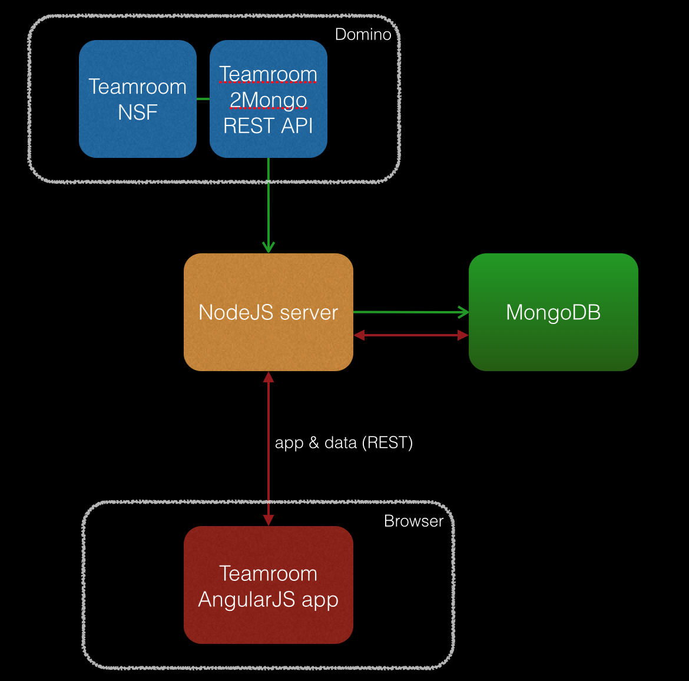

## Teamroom2mongo - Rewriting the Domino Teamroom using AngularJS and MongoDB ##

You've probably noticed the huge trend in web application development: client side JavaScript frameworks to build your apps with, using REST APIs to connect to data stores. You've probably also noticed that **MongoDB**, a NoSQL database, has been getting a lot of attention lately. Both technologies are adopted by more developers and companies every day.

We wondered what it would take to rewrite a well known standard Domino application using the **MEAN** stack: a combination of **MongoDB** (NoSQL database), **Express** (a NodeJS application server), **AngularJS** (a client side Javascript MVC framework) and **NodeJS** (JavaScript server). In this Github project we share the source code that came out of that process, which we hope will be helpful to other developers working on Domino to Mongo migration projects.

### Setup ###

### Software used ###

* Domino 9.0.1 FP1
* NodeJS (latest version)
* MongoDB (hosted on mongolab.com)
* [JSoup](http://jsoup.org) (Java project to parse HTML: used to correctly format HTML created from RichText on Domino)
* Node projects:
    - Express
    - Mongoos
    - [gridfs-stream](https://github.com/aheckmann/gridfs-stream)
* Clientside Javascript libraries (managed using Bower)
    - AngularJS
    - [Bootstrap](http://bootstrap.com)
    - [Bootcards](http://bootcards.org)
    - Font Awesome
    - Fastclick

### Getting data out of Domino ###

A Node script (teamroom-to-mongo.js) creates a connection to a REST API running on the Domino server (v9.0.1FP1). The REST API will send back JSON data containing information on all the documents and metadata about the application. This data is processed by the Node script and sent to a (cloud based) MongoDB instance. For this project we're using http://mongolab.com.

For the REST API we tried to use **Domino Data Services**, but it didn't create valid JSON. Reason for that was a field in Teamroom documents named **getDate**. In some documents this (DateTime) field was empty with no contents in it whatsoever and Domino Data Services doesn't seem to be able to handle that.

As a workaround, a custom (simple) REST API was created that will create valid JSON, including for the contents of RichText fields using a method described [here](http://linqed.eu/?p=500). This API is stored in a seperate database (NSF) that connects to configured Teamroom instance.

## Work in progress ##

This project is work in progress. There are a lot of areas that could (or need to) be improved:

* Authentication. The REST API to get data from Domino uses standard Domino authentication. The AngularJS app doesn't at the moment.
* User management.
* Create and edit documents in the AngularJS app.
* Implement different lists in the app.
* Showing discussion threads.
* AngularJS app UI.